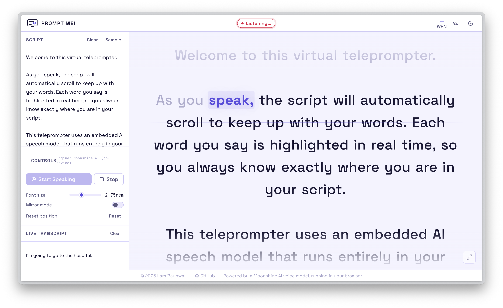

# AI-infused teleprompter running 100% in your browser

A teleprompter that follows your voice rather than a timer. Paste in a script, press record, and it highlights the current word and scrolls as you speak — no foot pedal, no backend, no data leaving the browser.

:sparkles: **[Try it online](https://larsbaunwall.github.io/promptme-ai)**

<picture>
  <source media="(prefers-color-scheme: dark)" srcset="screenshot-dark.png">
  <source media="(prefers-color-scheme: light)" srcset="screenshot-light.png">
  
</picture>

---

## How it works

Most teleprompters scroll at a fixed speed and trust you to keep up. This one inverts that: it listens continuously and tracks your position in the script in real time. If you pause, it waits. If you ad-lib a sentence, it finds its way back.

The speech recognition runs entirely inside the browser tab, embedded as an ONNX model. Nothing is sent anywhere.

## The embedded speech model

Recognition is handled by **[Moonshine](https://github.com/usefulsensors/moonshine)** (Useful Sensors), a compact ASR model designed for on-device use. It's loaded via [Transformers.js](https://huggingface.co/docs/transformers.js) and runs in dedicated Web Workers (one for voice activity detection, one for transcription), so it never competes with the UI thread.

The full pipeline looks like this:

```text
Microphone → AudioWorklet (PCM @ 16kHz)
           → Silero VAD (skips inference on silent frames)
           → Moonshine Tiny ONNX (speech-to-text)
           → Main thread (script matching + scroll)
```

### Architecture

```text
┌─────────────────────────────────────────────────────────────────┐
│  Browser main thread  (app.js)                                  │
│                                                                 │
│  ┌──────────┐  PCM   ┌───────────────────┐                      │
│  │ Audio    │───────▶│  VAD Worker       │                      │
│  │ Worklet  │ frames │  (vad.worker.js)  │                      │
│  │ 16 kHz   │        │                   │                      │
│  └──────────┘        │  Silero VAD ONNX  │                      │
│                      └────────┬──────────┘                      │
│                               │ speech segments                 │
│                               ▼                                 │
│                      ┌───────────────────┐                      │
│                      │  TX Worker        │                      │
│                      │  (transcribe.     │                      │
│                      │   worker.js)      │                      │
│                      │                   │                      │
│                      │  Moonshine ONNX   │                      │
│                      │  (WebGPU / WASM)  │                      │
│                      └────────┬──────────┘                      │
│                               │ transcript text                 │
│                               ▼                                 │
│  ┌──────────────────────────────────────────────────────────┐   │
│  │  Script Matcher                                          │   │
│  │                                                          │   │
│  │  Token index ──▶ Banded Levenshtein ──▶ Beam tracker     │   │
│  │  (Double Metaphone)   (O(n·k))          (multi-hyp)      │   │
│  └──────────────────────────┬───────────────────────────────┘   │
│                             │ confirmed word position           │
│                             ▼                                   │
│  ┌───────────────────────────────────────────────────────────┐  │
│  │  UI: highlight pill + rAF scroll lerp + creep ticker      │  │
│  └───────────────────────────────────────────────────────────┘  │
└─────────────────────────────────────────────────────────────────┘
```

Where WebGPU is available the model runs on the GPU; otherwise it falls back to WASM. On first load the model weights (~100 MB) are fetched and cached — after that the page works offline.

## Script position tracking

Getting the position right is the hard part. Speech is messy: filler words, mispronunciations, homophones, repetition across sections, and the fact that Moonshine emits results in ~600 ms batches rather than word by word. A simple substring search breaks almost immediately.

The tracker uses several layers to handle this:

### Banded Levenshtein over token windows

Position tracking is fundamentally a fuzzy matching problem. Spoken tokens are compared to sliding windows of script tokens using **word-level Levenshtein distance**. To avoid O(n²) cost over every window, only the diagonal band of width `k` is computed — bringing complexity down to **O(n·k)** — with an early exit once the running minimum exceeds the edit budget.

DP rows use pre-allocated `Int16Array` buffers that are reused across calls, keeping allocator pressure close to zero.

### Inverted token index for O(1) candidate generation

Before any DP runs, the script is indexed into a map of `token → [positions]`. Candidate windows are found by hash lookup on the incoming spoken tokens rather than by scanning the full script. The vast majority of windows are eliminated before a single Levenshtein cell is computed.

### Phonetic normalisation

Before any matching runs, each token is converted to its **Double Metaphone** code — a consonant-cluster encoding (Lawrence Philips, 2000) that maps homophones to the same key automatically. *right / write / rite* all become `RT`; *to / two / too* all become `T`; *their / there / they're*, *peace / piece*, *whether / weather* and thousands of other pairs collapse without any manual list. The encoding is computed once at script parse time, so query-time cost is just a hash lookup.

A four-entry `ASR_OVERRIDES` table handles the two cases Double Metaphone cannot resolve algorithmically: articles (*a* / *the*, which ASR frequently swaps) and the *an* / *and* pair (which DM encodes differently). Everything else is covered by the algorithm.

### Locality-aware scoring

Scripts repeat words. Without a locality signal, the matcher has no way to distinguish the third occurrence of "however" from the first. A distance penalty is applied to candidates further ahead of the last confirmed position, halving the effective score every 20 words of offset. This keeps the tracker anchored to the actual reading position rather than jumping to any high-scoring window in the script.

### Optimistic word creep

Moonshine's ~600 ms batch latency would cause the highlight to jump forward in visible lurches. Instead, the tracker measures your current speaking rate and **speculatively advances the highlight at ~85% of the measured WPM** between confirmed results. When the next transcript arrives the position snaps back to the confirmed location. The lookahead is capped at three words to limit how far it can stray. The underlying model is still processing in chunks; it just does not look that way.

## Features

- Runs entirely in the browser — no server, no API, no account
- WebGPU acceleration where supported, WASM fallback otherwise
- Mirror mode for use with a physical half-mirror rig
- Adjustable font size and speaking pace (WPM slider)
- Live WPM counter, progress indicator, and ETA
- Dark and light theme
- Works offline after first load

## Running locally

No build step. The models require `SharedArrayBuffer`, which needs cross-origin isolation headers — the included `coi-serviceworker.js` takes care of this.

```bash
# Python
python3 -m http.server 8080

# Node
npx serve .
```

Open `http://localhost:8080`.

## Stack

| Layer | Technology |
| --- | --- |
| Speech model | Moonshine Tiny ONNX (UsefulSensors) |
| ML runtime | Transformers.js v3 (Hugging Face) |
| VAD | Silero VAD ONNX |
| Inference backend | WebGPU / WASM (auto-detected) |
| Phonetic encoding | Double Metaphone (`words/double-metaphone`) |
| UI | Vanilla JS + CSS, no framework |

---

<a href="https://www.producthunt.com/products/prompt-me?embed=true&amp;utm_source=badge-featured&amp;utm_medium=badge&amp;utm_campaign=badge-prompt-me" target="_blank" rel="noopener noreferrer"></a>